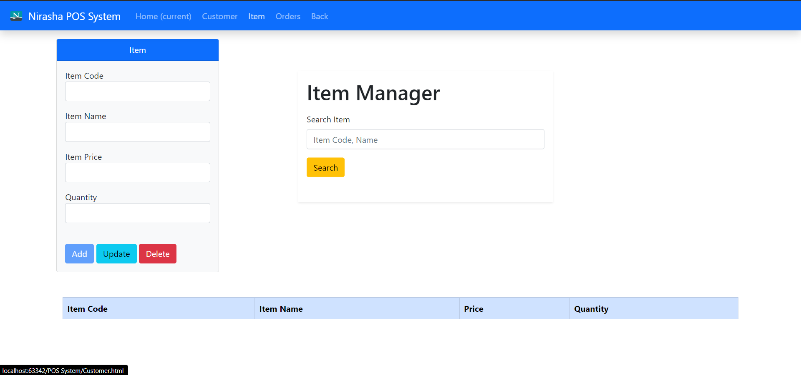

This project is done by using javaScript,Html,Css,JQuery and Bootstrap. 
There are some links that I use to make this POS System.

Site map = https://www.gloomaps.com/wTmcN9yMAT

Wire frame = https://wireframe.cc/UhVcqN

Mock up= https://www.figma.com/file/mIt7M0c6mPgkxm8hQuIhwp/Untitled?node-id=0%3A1

github = https://github.com/NirashaMadubhashini

##Screenshots of POS System##

Loging

DashBoard

Customer

Items

PlaceOrder

